# Mi proyecto de Python: Clases y objetos

## ¿Como fue diseñado?

Para este proyecto utilizamos la Programacion orientada a objetos (POO), para una mejor manejabilidad de el codigo utilizamos un sistema de "models" o **Clases** para poder representar cosas, como lo seria un libro o una cuenta de banco.

- Clases: Son los planos del programa 
- Objetos: Son las versiones reales de esos planos
- Metodos: Son las acciones que pueden hacer los objetos
- Init: Es lo que prepara al objeto apenas lo creamos

## ¿Como logramos proteger la informacion? Encapsulamiento
El diseño de clases del proyecto sigue los principios de Programacion Orientada a Objetos (POO), organizando los datos y comportamientos dentro de clases mediante atributos y metodos.

La encapsulacion se implementa con:
- Atributos protegidos (_atributos)
- Atributos privados(__atributo)
- metodos privados
- Getters y Setters
- Propiedades con @property

Esto permite controlar el acceso a la informacion interna y validar los datos antes de modificarlos.

Los metodos publicos representan las acciones disponibles para el usuario, mientras que los metodos privados manejan la logica interna de la clase.

## Ejemplos de Ejecucion (Salida en consola)

<b> Capturas 01 - 10 </b>

 

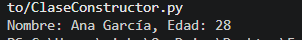

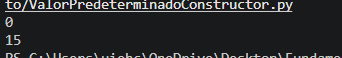

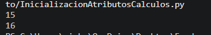

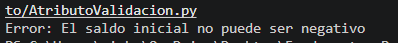

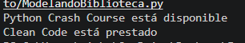

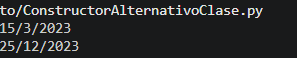

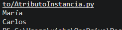

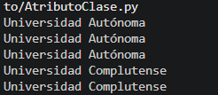

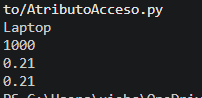

<b> Capturas 11 - 20 </b>

 

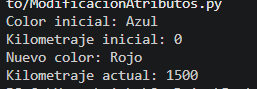

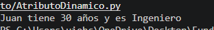

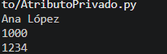

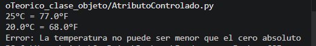

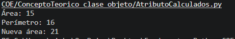

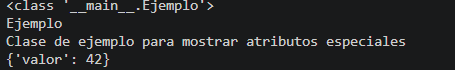

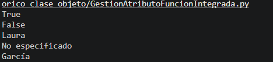

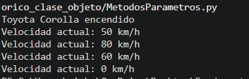

<b> Capturas 21 - 30</b>

 

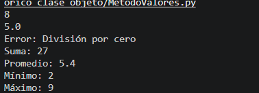

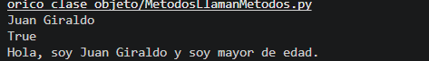

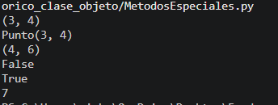

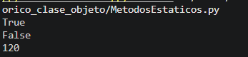

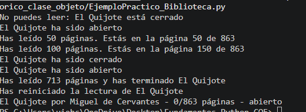

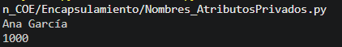

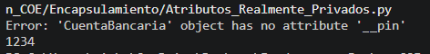

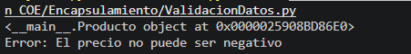

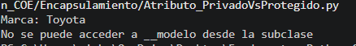

<b> Capturas 31 - 40</b>

 

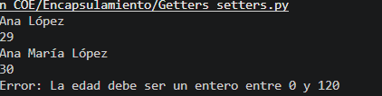

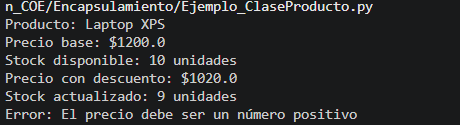

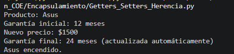

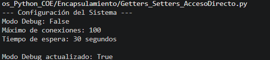

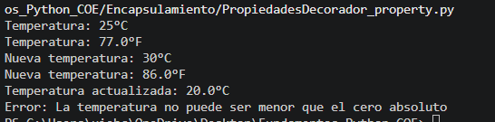

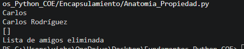

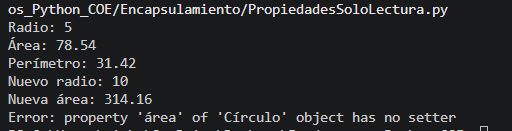

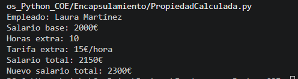

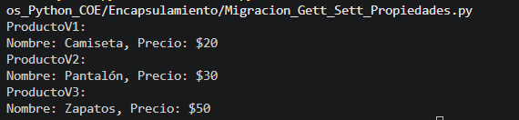

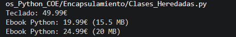

<b> Capturas 41 - 46</b>

 

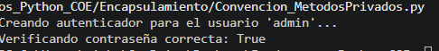

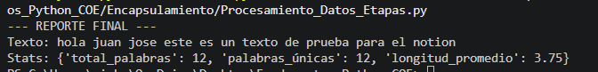

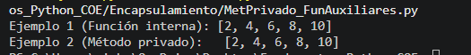

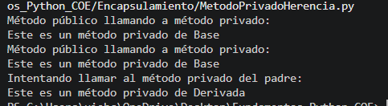

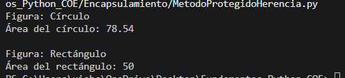

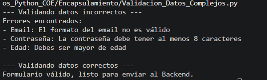

<b> Taller De clases y objetos </b>

 

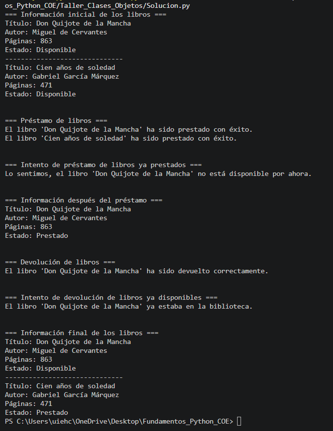

<b> Taller Encapsulamiento </b>

 

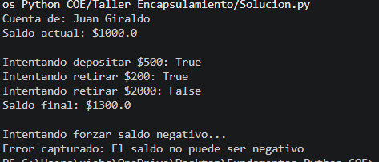

<b> Reto: Sistema de prestamos de equipos</b>

 

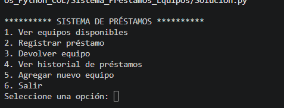

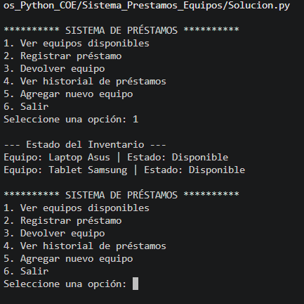

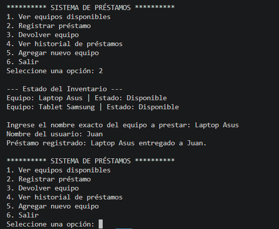

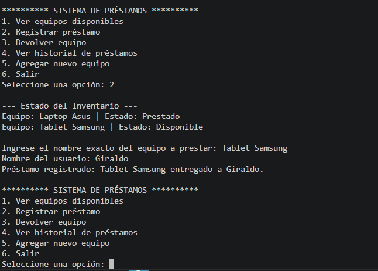

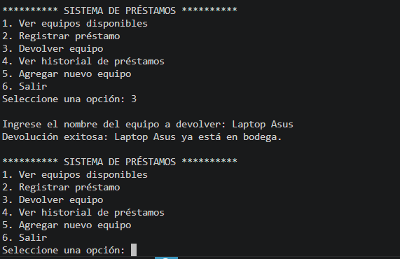

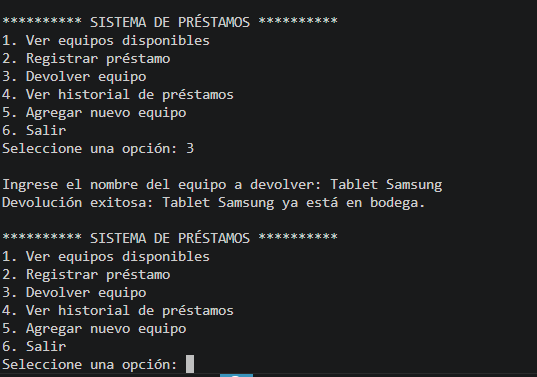

## Reflexion personal 

Durante esta actividad aprendi sobre los conceptos de programacion orientada a obejtos en Python, especialmente sobre lo que son las clases, objetos y el encapsulamiento.
Uno de los retos mas dificiles para mi fue aprender sobre los atributos privados - protegidos, Getters y las propiedades pero con la practica logre entender mas y como ayudan a proteger la organizacion de la informacion.